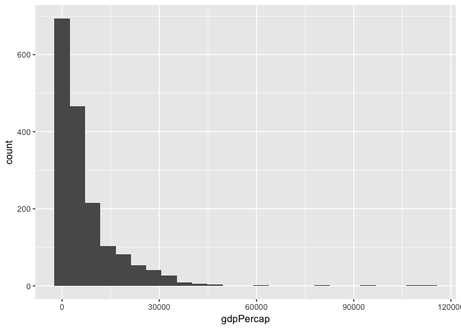

hw02\_gapminder
================
Emre
2018-09-24

``` r
library('tidyverse')
```

    ## ── Attaching packages ─────────────────────────────────────────────────────────────────────────────────────── tidyverse 1.2.1 ──

    ## ✔ ggplot2 2.2.1     ✔ purrr   0.2.5
    ## ✔ tibble  1.4.2     ✔ dplyr   0.7.4
    ## ✔ tidyr   0.7.2     ✔ stringr 1.3.1
    ## ✔ readr   1.1.1     ✔ forcats 0.2.0

    ## ── Conflicts ────────────────────────────────────────────────────────────────────────────────────────── tidyverse_conflicts() ──
    ## ✖ dplyr::filter() masks stats::filter()
    ## ✖ dplyr::lag()    masks stats::lag()

``` r
library('gapminder')
library('ggplot2')
```

## Smelling the data

### Is it a data.frame, a matrix, a vector, a list?

``` r
typeof(gapminder)
```

    ## [1] "list"

`gapminder` is of type list.

### What is its class?

``` r
class(gapminder)
```

    ## [1] "tbl_df"     "tbl"        "data.frame"

`gapminder` is a tibble, which is a [modern take on data
frames](https://cran.r-project.org/web/packages/tibble/vignettes/tibble.html)

### How many variables/columns?

``` r
ncol(gapminder)
```

    ## [1] 6

`gapminder` has 6 columns.

### How many rows/observations?

``` r
nrow(gapminder)
```

    ## [1] 1704

There are 1704
rows.

### Can you get these facts about “extent” or “size” in more than one way? Can you imagine different functions being useful in different contexts?

Yes there are many different ways to get the
shape/size/dimensions/extent of `gapminder`. I’ve provided some examples
below. Some of the options are better when the output is required for
another part of code, and other methods are better when you want to view
the
    result.

``` r
str(gapminder)
```

    ## Classes 'tbl_df', 'tbl' and 'data.frame':    1704 obs. of  6 variables:
    ##  $ country  : Factor w/ 142 levels "Afghanistan",..: 1 1 1 1 1 1 1 1 1 1 ...
    ##  $ continent: Factor w/ 5 levels "Africa","Americas",..: 3 3 3 3 3 3 3 3 3 3 ...
    ##  $ year     : int  1952 1957 1962 1967 1972 1977 1982 1987 1992 1997 ...
    ##  $ lifeExp  : num  28.8 30.3 32 34 36.1 ...
    ##  $ pop      : int  8425333 9240934 10267083 11537966 13079460 14880372 12881816 13867957 16317921 22227415 ...
    ##  $ gdpPercap: num  779 821 853 836 740 ...

``` r
length(gapminder)
```

    ## [1] 6

``` r
dim(gapminder)
```

    ## [1] 1704    6

### What data type is each variable?

``` r
sapply(gapminder, typeof)
```

    ##   country continent      year   lifeExp       pop gdpPercap 
    ## "integer" "integer" "integer"  "double" "integer"  "double"

`country`: integer

`continent`: integer

`year`: integer

`lifeExp`: double

`pop`: integer

`gdpPercap`:
double

## Explore individual variables

### Exploring `continent`

#### What are possible values (or range, whichever is appropriate) of each variable?

``` r
unique(gapminder$continent)
```

    ## [1] Asia     Europe   Africa   Americas Oceania 
    ## Levels: Africa Americas Asia Europe Oceania

#### What values are typical? What’s the spread? What’s the distribution? Etc., tailored to the variable at hand.

``` r
ggplot(gapminder, aes(continent)) +
  geom_histogram(stat = 'count')
```

    ## Warning: Ignoring unknown parameters: binwidth, bins, pad

<!-- -->

Africa is the most common continent, while Oceania is the least common.
The spread and distribution are described in the above
plot.

### Exploring `gdpPercap`

#### What are possible values (or range, whichever is appropriate) of each variable?

``` r
range(gapminder$gdpPercap)
```

    ## [1]    241.1659 113523.1329

The minimum `gdpPercap` is 241.17 and the maximum is
113523.13

#### What values are typical? What’s the spread? What’s the distribution? Etc., tailored to the variable at hand.

``` r
ggplot(gapminder, aes(gdpPercap)) +
  geom_histogram(bins=25)
```

<!-- -->

The distribution decays exponentially.

``` r
ggplot(gapminder, aes(x = '', y = gdpPercap)) +
  geom_boxplot()
```

<!-- -->

``` r
sd(gapminder$gdpPercap)
```

    ## [1] 9857.455

The spread can be described by the standard deviation, which is 9857.455

### Exploring various plot types

``` r
gapminder %>%
  ggplot(aes(gdpPercap, lifeExp)) +
  scale_x_log10() + 
  geom_point()
```

<!-- -->

``` r
gapminder %>%
  ggplot(aes(lifeExp)) +
  geom_histogram()
```

    ## `stat_bin()` using `bins = 30`. Pick better value with `binwidth`.

<!-- -->

``` r
gapminder %>%
  ggplot(aes(continent, lifeExp)) +
  geom_boxplot()
```

<!-- -->

### Using `select` and `filter` with piping into `ggplot`

``` r
gapminder %>%
  select(c(continent, gdpPercap, year)) %>%
  filter(year %in% 1960:1980) %>%
  ggplot(aes(continent, gdpPercap)) +
  scale_y_log10() +
  geom_boxplot()
```

<!-- -->

``` r
gapminder %>%
  select(c(country, pop, gdpPercap, year)) %>%
  filter(gdpPercap > mean(gdpPercap)+2.5*sd(gdpPercap)) %>%
  filter(year == 1997) %>%
  ggplot(aes(country, pop)) +
  geom_point()
```

<!-- -->

### But I want to do more\!

``` r
filter(gapminder, country == c("Rwanda", "Afghanistan"))
```

    ## # A tibble: 12 x 6
    ##    country     continent  year lifeExp      pop gdpPercap
    ##    <fct>       <fct>     <int>   <dbl>    <int>     <dbl>
    ##  1 Afghanistan Asia       1957    30.3  9240934      821.
    ##  2 Afghanistan Asia       1967    34.0 11537966      836.
    ##  3 Afghanistan Asia       1977    38.4 14880372      786.
    ##  4 Afghanistan Asia       1987    40.8 13867957      852.
    ##  5 Afghanistan Asia       1997    41.8 22227415      635.
    ##  6 Afghanistan Asia       2007    43.8 31889923      975.
    ##  7 Rwanda      Africa     1952    40    2534927      493.
    ##  8 Rwanda      Africa     1962    43    3051242      597.
    ##  9 Rwanda      Africa     1972    44.6  3992121      591.
    ## 10 Rwanda      Africa     1982    46.2  5507565      882.
    ## 11 Rwanda      Africa     1992    23.6  7290203      737.
    ## 12 Rwanda      Africa     2002    43.4  7852401      786.

The above code should be:

``` r
filter(gapminder, country=='Rwanda' | country=='Afghanistan')
```

    ## # A tibble: 24 x 6
    ##    country     continent  year lifeExp      pop gdpPercap
    ##    <fct>       <fct>     <int>   <dbl>    <int>     <dbl>
    ##  1 Afghanistan Asia       1952    28.8  8425333      779.
    ##  2 Afghanistan Asia       1957    30.3  9240934      821.
    ##  3 Afghanistan Asia       1962    32.0 10267083      853.
    ##  4 Afghanistan Asia       1967    34.0 11537966      836.
    ##  5 Afghanistan Asia       1972    36.1 13079460      740.
    ##  6 Afghanistan Asia       1977    38.4 14880372      786.
    ##  7 Afghanistan Asia       1982    39.9 12881816      978.
    ##  8 Afghanistan Asia       1987    40.8 13867957      852.
    ##  9 Afghanistan Asia       1992    41.7 16317921      649.
    ## 10 Afghanistan Asia       1997    41.8 22227415      635.
    ## # ... with 14 more rows

``` r
# OR
filter(gapminder, country %in% c('Rwanda', 'Afghanistan'))
```

    ## # A tibble: 24 x 6
    ##    country     continent  year lifeExp      pop gdpPercap
    ##    <fct>       <fct>     <int>   <dbl>    <int>     <dbl>
    ##  1 Afghanistan Asia       1952    28.8  8425333      779.
    ##  2 Afghanistan Asia       1957    30.3  9240934      821.
    ##  3 Afghanistan Asia       1962    32.0 10267083      853.
    ##  4 Afghanistan Asia       1967    34.0 11537966      836.
    ##  5 Afghanistan Asia       1972    36.1 13079460      740.
    ##  6 Afghanistan Asia       1977    38.4 14880372      786.
    ##  7 Afghanistan Asia       1982    39.9 12881816      978.
    ##  8 Afghanistan Asia       1987    40.8 13867957      852.
    ##  9 Afghanistan Asia       1992    41.7 16317921      649.
    ## 10 Afghanistan Asia       1997    41.8 22227415      635.
    ## # ... with 14 more rows

Let’s view that filter using `kable`:

``` r
library('knitr')
kable(filter(gapminder, country %in% c('Rwanda', 'Afghanistan')))
```

| country     | continent | year | lifeExp |      pop | gdpPercap |
| :---------- | :-------- | ---: | ------: | -------: | --------: |
| Afghanistan | Asia      | 1952 |  28.801 |  8425333 |  779.4453 |
| Afghanistan | Asia      | 1957 |  30.332 |  9240934 |  820.8530 |
| Afghanistan | Asia      | 1962 |  31.997 | 10267083 |  853.1007 |
| Afghanistan | Asia      | 1967 |  34.020 | 11537966 |  836.1971 |
| Afghanistan | Asia      | 1972 |  36.088 | 13079460 |  739.9811 |
| Afghanistan | Asia      | 1977 |  38.438 | 14880372 |  786.1134 |
| Afghanistan | Asia      | 1982 |  39.854 | 12881816 |  978.0114 |
| Afghanistan | Asia      | 1987 |  40.822 | 13867957 |  852.3959 |
| Afghanistan | Asia      | 1992 |  41.674 | 16317921 |  649.3414 |
| Afghanistan | Asia      | 1997 |  41.763 | 22227415 |  635.3414 |
| Afghanistan | Asia      | 2002 |  42.129 | 25268405 |  726.7341 |
| Afghanistan | Asia      | 2007 |  43.828 | 31889923 |  974.5803 |
| Rwanda      | Africa    | 1952 |  40.000 |  2534927 |  493.3239 |
| Rwanda      | Africa    | 1957 |  41.500 |  2822082 |  540.2894 |
| Rwanda      | Africa    | 1962 |  43.000 |  3051242 |  597.4731 |
| Rwanda      | Africa    | 1967 |  44.100 |  3451079 |  510.9637 |
| Rwanda      | Africa    | 1972 |  44.600 |  3992121 |  590.5807 |
| Rwanda      | Africa    | 1977 |  45.000 |  4657072 |  670.0806 |
| Rwanda      | Africa    | 1982 |  46.218 |  5507565 |  881.5706 |
| Rwanda      | Africa    | 1987 |  44.020 |  6349365 |  847.9912 |
| Rwanda      | Africa    | 1992 |  23.599 |  7290203 |  737.0686 |
| Rwanda      | Africa    | 1997 |  36.087 |  7212583 |  589.9445 |
| Rwanda      | Africa    | 2002 |  43.413 |  7852401 |  785.6538 |
| Rwanda      | Africa    | 2007 |  46.242 |  8860588 |  863.0885 |
